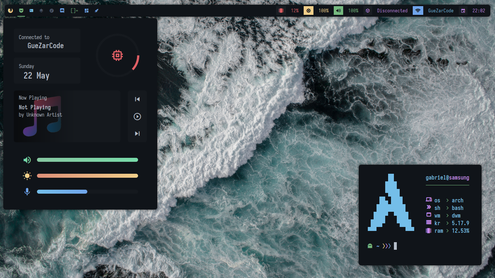

# My Custom Dwm Build

This is my custom dwm build which not uses dwmblocks or something similar for bar, i created a custom script approaching the status2d patch :3



[Enjoy notes](#enjoy)

## Requirements

- JetBrainsMono Nerd Font (general font)
- Iosevka Nerd Font (for dashboard with eww)
- MaterialDesign Font (download from [this](https://github.com/Templarian/MaterialDesign-Font/))
- eww (for dashboard)
- fish (as shell)
- feh
- starship (for make fish prompt)
- rofi (for select apps)
- dunst (for notifications)
- picom (compositor)
- light (for get brightness)
- exa (ls replacement)
- bat (cat replacement)
- alsa-utils (for amixer)
- wireless\_tools (iwgetid)

## About this

### Dwm patches

- statuspadding + status2d fix patch (extracted from chadwm and really manually modified by me)
- barpadding
- dragmfact
- launchers
- rainbowtags
- warp
- underlinetag 
- status2d
- restartsig
- rotatestack
- fullgaps
- bar-height
- fixborders
- notitle
- pertag

### St

The st config is based in [siduck's st build](https://github.com/siduck/st)

## Installation

> First make sure u have all the [requirements](#requirements) installed on ur system

1. Clone the repo:

```sh
git clone https://github.com/AlphaTechnolog/dwm.git dwm
cd dwm
```

2. Then, copy the configs:

**IF EXISTS SOME CONFIGURATION FILES IN ~/.config | ~/.local/bin | ~/ IT'LL BE REPLACED**

```sh
cp -r ./config/* ~/.config
cp -r ./bin/* ~/.local/bin
cp -r ./home/* ~/
```

Use `xrdb` to merge `colors`

```sh
xrdb merge ~/.Xresources
```

3. Compile dwm

```sh
cd ~/.config/dwm/src
test -f config.h && rm config.h
sudo make clean install
```

4. Compile st

```sh
cd ~/.config/st
test -f config.h && rm config.h
sudo make clean install
```

5. Create the launcher

If u're using a login manager like sddm or lightdm u can copy the .desktop to `/usr/share/xsessions` and replace in the file
`/usr/share/xsessions/dwm.desktop` the name `gabriel` to ur username.

```sh
sudo cp -r ./launchers/dwm.desktop /usr/share/xsessions
sudo nvim /usr/share/xsessions/dwm.desktop # and change gabriel to ur username in the file
```

If u're using startx, u can copy the file xinitrc, that contains an example orders to execute dwm, feel tree to customize it:

```sh
cp -r ./launchers/xinitrc ~/.xinitrc
```

Then startx:

```sh
startx
```

## Enjoy!

I hope u like this :3

if yes, please give me a star

If u want to use neovim without terminal padding and at exit get back ur terminal padding, use `nv` in st terminal :3
